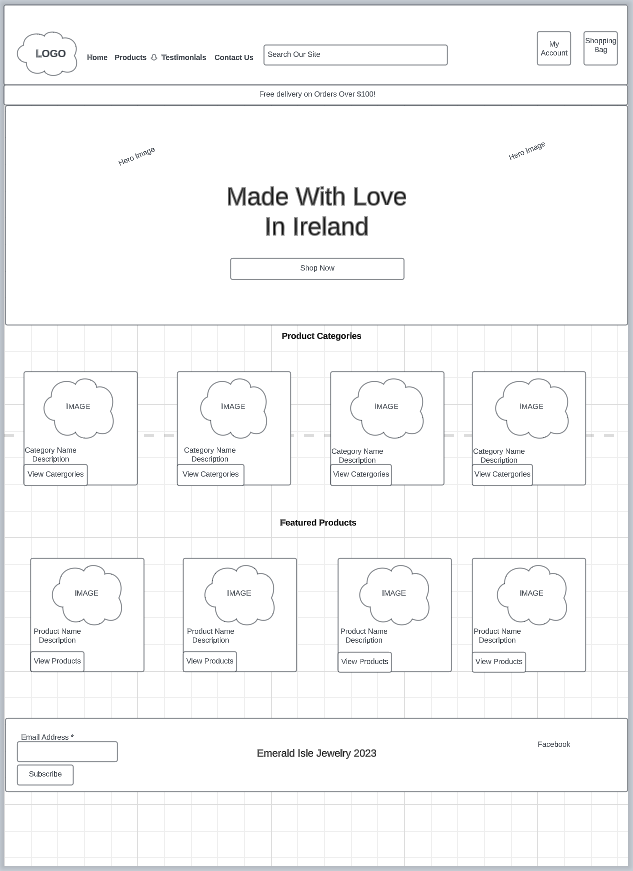
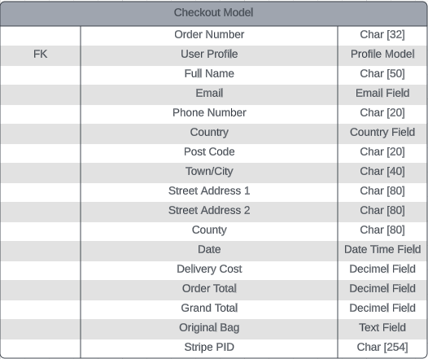
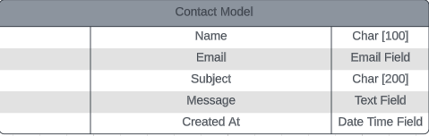
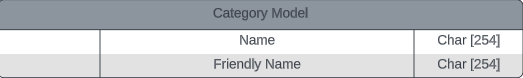
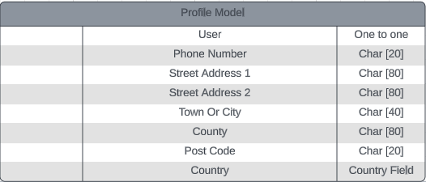
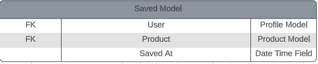
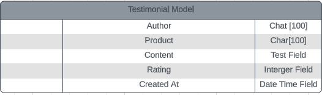

## Emerald Isle Jewelry

Emerald Isle Jewelry is a fictional jewelry store specilaising in Irish made Celtic Jewelry. The sotre is built using Django, Python, Bootstrap, HTML and CSS and the sites main goal is to provde the user with an east to use interface where they can purchase and browse all items the online store has to offer. 

The idea for this project came from an online store I built myself and have since close before which sold Celtic Jewelry.

The deployed site can be viewed [here](https://emerald-isle-jewelry-af11dcd57db0.herokuapp.com/)


## UI/UX ##

The overall design is minimalistic and contemporary. High quality product images were used throughout as the overall theme was kept to a minimum as to not take away from those images. The overall layout is what you would expect from alot of E-commerce sites. A few products are displayed on the homepage along with some inviting links to encourage the user to delve deeper into the site.  

**Agile**

The agile approach was employed in designing and constructing this project, from the outset of planning to the completion of development. To facilitate the process, I established a GitHub project and adopted the Kanban board methodology to divide project components into user stories and feasible tasks.

For a comprehensive view of all user stories please refer to the linked project [Project Kanban Board](https://github.com/users/oconnorian3/projects/11/views/1). 

## Wireframe ##

Below is a basic Wireframe of the homepage the project started.




## Planning Phase ##

**Strategy**

*Site Aims*

This is a fictional project but below are some aims if the site was to go into production.

Our aim is to celebrate and preserve the rich heritage of Celtic culture by offering a wide range of authentic Celtic jewelry designs inspired by traditional motifs and symbols. We strive to offer meticulously handcrafted Celtic jewelry pieces that showcase exceptional quality and attention to detail, ensuring that our customers receive timeless and durable pieces they can cherish for years to come. We strive to create a user-friendly and secure online platform that provides customers with a seamless shopping experience, offering detailed product information, multiple payment options, and prompt customer support.

The amount of products I could add is vast but due to time contraints and since this is a fictional project I will focus on they key items. Below are some core items this store would need to have. 

* Claddagh Rings
* Celtic Brooches
* Celtic Inpired Necklaces
* Celtic Inspired Earrings

The website caters to the following target groups:

 * User Roles:

    * Standard User
    * Account User
    * Administrator

 * Demographics

    * Mainly women with Irish Heritage
    * Main market will be the USA but Worldwide shipping will be an option

 * The website must provide the user with the ability to:

    * Browse and purchase products
    * Create an account 
    * Checkout as a guest user   
    * Fill out a contact form 
    * Leave a post sale testimonial

 * The website must provide the admin with the ability to:

    * Remove add and edit products 
    * Manage profiles  

*Scope*

In order to meet the project timeline and grading criteria, it is necessary to make trade-offs during the design and development process. To effectively manage this, I will employ the agile methodology. This involves conducting weekly progress reviews and making necessary adjustments to the features, whether by adding, adapting, or removing them, based on the project requirements.

*Structure*

The site's layout is structured around ease of viewing products to make a seamless shopping experience and encourage sales. The home page has a large Shop Now button aswell as a featued Catergories and Product section. The nav bar also has a link to products aswell as various prompts/links throughout the site which will bring the user back to the products page.

*Skeleton*

Wireframes were made using Lucid. Please click [here](https://github.com/oconnorian3/emerald-isle-jewelry/blob/main/README.md#Wireframe) to view Wireframes.

*Surface*

This pertains to the visual design aspect and how to effectively convey the desired emotions and effects. For a more comprehensive understanding of planning for the surface plane please see below.

**Colour Scheme**

A light green background (#ebf3eb) for all pages was chosen throughout the site. This fitted in well with the overall theme of the site while also remaining light enough to allow images and other features and links throughout the site standout. 


The colour (#494932) was used for the footer and various button and links throughout. This colour stands out and ties in well against the light green background while not been to harsh. 


**Fonts**

Add content

**Images and Logos/Icons**

The product images were taken from the our suppliers site. Font awesome was used for the various icoms throughout the site. 

## Marketing Stratergy ##

**Introduction:**

Emerald Isle Jewelry is a boutique Irish business that takes pride in crafting exquisite Celtic jewelry, capturing the rich cultural heritage and beauty of Ireland. This marketing strategy outlines a comprehensive plan to elevate the brands presence, engage with the target audience, and drive sales through a combination of online and offline strategies.

1. Brand Identity and Positioning:
Highlight the authenticity, craftsmanship, and uniqueness of our Irish-made Celtic jewelry. Emphasize the blend of tradition and contemporary designs that sets Emerald Isle Jewelry apart in the market.

2. Website Enhancement:
Optimize the website for an enhanced user experience. Showcase high-quality images of our jewelry, provide detailed product descriptions, and create an easy-to-navigate layout. Incorporate customer testimonials to build trust.

3. Newsletter Signup:
Maximize the potential of the newsletter signup form. 

4. Content Marketing:
Develop a blog section on the website to share articles about Celtic history, symbolism, jewelry care tips, and more. Create informative and engaging content that resonates with the audience's interests.

5. Social Media Strategy:
Leverage platforms like Instagram, Facebook, and Pinterest to visually showcase our jewelry. Regularly post high-quality images, behind-the-scenes glimpses of our craftsmanship, and stories that reflect the essence of Irish culture.

6. Influencer Collaborations:
Partner with influencers in the fashion and jewelry niche who align with the brand values. Their endorsement can introduce the jewelry to a wider audience and enhance our credibility.

7. Email Marketing Campaigns:
Send out regular newsletters to the subscribers, featuring new arrivals, limited-edition collections, and exclusive offers. Personalize the content to create a sense of exclusivity for subscribers.

8. Search Engine Optimization (SEO):
Implement strong SEO practices to improve the website's visibility on search engines. Optimize product descriptions, use relevant keywords, and focus on local SEO to attract customers searching for Irish jewelry.

9. Local Partnerships:
Collaborate with local Irish gift shops, cultural centers, and tourism outlets. Offer to showcase our jewelry in their establishments, expanding the reach within the local community and among tourists.

10. Customer Engagement and Feedback:
Encourage customer engagement through social media contests, polls, and interactive posts. Actively seek and showcase customer feedback and reviews to build trust and authenticity.

Incorporating these strategies will create a holistic approach to promoting Emerald Isle Jewelry. By enhancing the online presence, engaging with our audience authentically, and consistently delivering quality, we will strengthen our brand's position and drive growth for our business.

## Features ##

**Navigation**

 * Navigation bar with logo and links
 * Navigation bar with account login logo which allows customer access or create an account
 * Navigation bar with shopping bag logo which allows user view their total and their shopping bag
 * Responsive menu which collapes into a burger on small to medium screens
 * Search bar so user can search for what they want as opposed to trawling through product pages


**Landing Page**

 * The landing page will display a large hero image with a large Shop Now button
 * The landing page will display four featured Products and four featured Catergories
 * The landing page will display both the headers and footer with easily identifiable links to 
   help the user  navigate throughout the site
 * The landing page will display a free shipping banner across the top to encourage shoppers 
   to hit the minimum limit for free shipping
 * The landing page will display a "subscribe" feature in the footer to allow users sign up for regular updates


**Testimonials**

 * Allows users view testimonials from previous customers
 * Users will receive a link in their order confirmation email with s link so they can provide a testimonial


**Contact Us**

 * This is a simple form which allows the user contact the site admins directly. The form will not submit unless 
   all fields are filled out. The email field requires a valid email.
 * All information is saved to the database and can be easily accessed using the /admin url. 


**Categories Section**

 * Allows user view products by catergory
 * Displays full list of products for that catergory 
 * Allows user sort products by price, rating , name & catergory for the all products section

 

**Product Pages**

 * Provides user with large image of the product
 * Provies a detailed product description
 * Allows user add product to their shopping bag
 * Allows user select size where appropriate
 * Allows user add whatever qunatity of the product they would like
 * Button in place to allow user go back to the products page


**My Account**

 *Register*

 * Allows users register for an account
 * Fields include Email address, Email Confirmation, Username, Password and Password confirmation
 * Has an embedded link which takes the user back to the login page should they need to


 *Login*

 * Login form asking for username and password of signed up user
 * Fields include Username/Email & Password
 * Includes "Remember me" checkbox option
 * Has an embedded link which takes the user back to the register page should they need to
 * Allows user reset their password should they need to


 *My Profile (For Authenticated Users Only)*

 * Allows users update their shipping information so they do not have to fill this field out during checkout
 * Allows users view past order history

    

 *Product Management (For Super Users Only)*

 * Allows users to add new products through an easy to use interface
 * Also allows you delete or edit live products

    


 *Logout (For Authenticated Users Only)*

 * Separate page prompts user to confirm action to sign out


**Shopping Bag**

 * Allows users view the contents of the shopping bag
 * Allows users remove items 
 * Allows users update quantity
 * Allows users view total
 * Will let user know how much extras they need to spend for free shipping or cost of shipping as total stands
 * Gives user the option to keep shopping or proceed to checkout

 

**Checkout**

 * Prompts users to fill all required details and billing information. 
 * There is an "*" on required fields which will not allow you process unless filled out
 * Embedded link allowing users to register or login to an account which would then save the billing information
 * Credit card field will alert user if credit card information is incorrect
 * Provides summary of purchase
 * Allows user to go back and adjust the shopping bag or proceed with purchase once all info is submitted
 * Fail safes are in place to process orders correctly should user disconnect while sale is processing
 * Directs user to a success page to confirm transaction was successful


**Footer**

 * Users can submit their emails so they can subscibe to our marketing emails
 * Links to social media


**Custom 404**


## Oppurtunities For Future Features ##

 * Allow super users set a quantity for products so items which are out of stock become unavailable for purchase
 * Implement a pop up when the user visits the home page initially which would advertise a sale or ask 
   for them to sign up to our newsletter
 * Automatically apply the rating value from the testimonial to the products as opposed to trying 
   to work it out manually
 * Approve testimonials before they are published , they can however be removed 
 * Intergrate more social media
 * Add a blog

## Database Models ##

## Database Flowchart ##


I used Lucid to design the Database models.














## Testing ##

I have included testing details during and post-development in a separate document called [TESTING.MD](https://github.com/oconnorian3/emerald-isle-jewelry/blob/main/TESTING.md)

## Technologies Used ##

**Main Languages Used**

 * HTML5
 * CSS3
 * Python

**Hosting and Work**

 * Lucid (Wireframe and DB model Diagrams)
 * GitHub (Version Control)
 * GitPod (IDE)
 * Heroku (Hosting site)
 * AWS (Static Files)
 * Elephant SQL (Database)
 * Stripe Payments

**Python Libraries**

 * PyJWT (Python library that provides a way to encode and decode JSON Web Tokens (JWTs). JWT is a compact, URL-safe means 
    of representing claims to be transferred between two parties. It can be used for authentication and authorization purposes in web applications )
 * Gunicorn (Python HTTP server for WSGI applications)
 * pyscopg2 (PostgreSQL Database adapter)

**Django Libraries**

 * django-allauth (User authentication)
 * django-crispy-forms (Control rendering behaviour of Django forms)
 * django-bootstrap4 (A third-party package for Django web framework that provides integration with the popular front-end framework Bootstrap 4. 
   It allows developers to easily use Bootstrap's styling and components in their Django templates, without having to write the HTML and CSS code manually)
 * whitenoise ( Helps with static files on Heroku)


## Deployment ##

This project was deployed using Heroku, AWS S3, ElephantSQL

The following steps describe the required libraries to ensure successful deployment on Heroku.

 * Install Gunicorn (server used to run Django on Heroku): pip3 install django gunicorn
 * Install pyscopg2 (connects to PostgreSQL): pip 3 install dj_database_url pyscopg2
 * Setup AWS Account (Amazon Web Services s3)

**Creating the Heroku App**

 * Log into Heroku and go to the Dashboard
 * Click New and select Create new app from the drop-down
 * Name app appropriately and choose relevant region, then click Create App

**Create PostgreSQL database using ElephantSQL**

Creating a database accessible by Heroku is essential, as the database provided by Django cannot be accessed by a deployed Heroku app.

 * Log into ElephantSQL and go to Dashboard
 * Click Create New Instance
 * Set up a plan by providing a Name (project name) and select a Plan (for this project the free plan "Tiny Turtle" was chosen). Tags are optional.
 * Click Select Region and choose appropriate Data center
 * Click Review, check all details and click Create Instance
 * Return to Dashboard on click on the name of the newly created instance
 * Copy the database URL from the details section

**Update Settings**

 * Connect django project to env.py file
 * Remove Secret Key provided by Django and refer to key set in Heroku settings instead
 * To connect to new database, replace provided DATABASE variable with

```
 DATABASES = {
    'default': dj_database_url.parse(os.environ.get("DATABASE_URL"))
}
```
 * Save and migrate all changes made

**Connecting Heroku to Database**

 * In Heroku dashboard, go to Settings tab
 * Add twelve new config vars


**Connect To Amazon AWS S3**

 1. Create a new S3 bucket:

    * Click "Services" in the top left-hand corner of the landing page, click on "Storage" then click "S3."
    * Click "Create bucket."
    * Give the bucket a unique name:
    * Select the nearest location:
        For me, this was EU (Frankfurt) eu-central-1.
    * Under the "Object Ownership" section, select "ACLS enabled"
    * Under the "Block Public Access settings for this bucket" section, untick "Block all public access" and tick 
      the box to acknowledge that this will make the bucket public.
    * Click "Create bucket."

 2. Amend Bucket settings:

    * Bucket Properties: -

     * Click on the bucket name to open the bucket.
     * Click on the "Properties" tab.
     * Under the "Static website hosting" section, click "Edit."
     * Under the "Static website hosting" section select "Enable".
     * Under the "Hosting type" section ensure "Host a static website" is selected.
     * Under the "Index document" section enter "index.html".
     * Click "Save changes."

    * Bucket Permissions: -
     * Click on the "Permissions" tab.
     * Scroll down to the "CORS configuration" section and click edit.
     * Enter the following snippet into the text box:
```
         [
             {
                 "AllowedHeaders": [
                 "Authorization"
                 ],
                 "AllowedMethods": [
                 "GET"
                 ],
                 "AllowedOrigins": [
                 "*"
                 ],
                 "ExposeHeaders": []
             }
         ]
```
   * Cont'd 
     * Click "Save changes."
     * Scroll back up to the "Bucket Policy" section and click "Edit."
     * Take note of the "Bucket ARN" click on the "Policy Generator" button to open the AWS policy generator in a new tab.
     * In the newly opened tab under Step 1 "Select Policy Type" select "S3 Bucket Policy." from the drop down menu.
     * Under Step 2 "Add Statement(s)" enter " * " in the "Principal" text box.
     * From the "s3:Action" drop down menu select "s3:GetObject".
     * Enter the "ARN" noted from the bucket policy page into the "Amazon Resource Name (ARN)" text box.
     * Click "Add Statement."
     * Under Step 3 "Generate Policy" click "Generate Policy."
     * Copy the resultant policy and paste it into the bucket policy text box on the previous tab.
     * In the same text box add "/*" to the end of the resource key to allow access to all resources in this bucket.
     * Click "Save changes."
     * When back on the buckets permissions tab, scroll down to the "Access Control List" section and click "Edit."
     * Enable "List" for "Everyone (public access)", tick the box to accept that "I understand the effects of these changes on my objects and buckets." and click "Save changes."

 3. Create AWS static files User and assign to S3 Bucket:

    * Create "User Group": -
      * Click "Services" in the top left-hand corner of the landing page, from the left side of the menu click on 
        "Security, Identity, &    Compliance"   and select "IAM" from the right side of the menu.
      * Under "Access management" click "User Groups."
      * Click "Create Group."
      * Enter a user name (in the case of this project, I called the user group "manage-pp5-vapeshop").
      * Scroll to the bottom of the page and click "Create Group."
    * Create permissions policy for the new user group: -
      * Click "Policies" in the left-hand menu.
      * Click "Create Policy."
      * Click "Import managed policy."
      * Search for "AmazonS3FullAccess", select this policy, and click "Import".
      * Click "JSON" under "Policy Document" to see the imported policy
      * Copy the bucket ARN from the bucket policy page and paste it into the "Resource" section of the JSON snippet. 
        Be sure to remove the default  value of the resource key ("*") and replace it with the bucket ARN.
      * Copy the bucket ARN a second time into the "Resource" section of the JSON snippet. This time, add "/*" 
        to the end of the ARN to allow access to all resources in this bucket.
      * Click "Next: Tags."
      * Click "Next: Review."
      * Click "Review Policy."
      * Enter a name for the policy (in the case of this project, I called the policy "pp5-vapeshop-policy").
      * Enter a description for the policy.
      * Click "Create Policy."
    * Attach Policy to User Group: -
      * Click "User Groups" in the left-hand menu.
      * Click on the user group name created during the above step.
      * Select the "Permissions" tab.
      * Click "Attach Policy."
      * Search for the policy created during the above step, and select it.
      * Click "Attach Policy."
    * Create User: -
      * Click "Users" in the left-hand menu.
      * Click "Add user."
      * Enter a "User name" (in the case of this project, I called the user "pp5-vapeshop-staticfiles-user").
      * Select "Programmatic access" and "AWS Management Console access."
      * Click "Next: Permissions."
      * Select "Add user to group."
      * Select the user group created during the above step.
      * Click "Next: Tags."
      * Click "Next: Review."
      * Click "Create user."
      * Take note of the "Access key ID" and "Secret access key" as these will be needed to connect to the S3 bucket.
      * Click "Download .csv" to download the credentials.
      * Click "Close."

 4. Install required packages to used AWS S3 Bucket in Django:

   * `pip install boto3`
   * `pip install django-storages`


 5. Add 'storages' to the bottom of the installed apps section of settings.py file:

 ```
  INSTALLED_APPS = [
 …,
     'storages'
 …,
]
 ```

 *To define AWS  as static file storage add the following to settings.py*

 ```
  # Static and media files
    STATICFILES_STORAGE = 'custom_storages.StaticStorage'
    STATICFILES_LOCATION = 'static'
    DEFAULT_FILE_STORAGE = 'custom_storages.MediaStorage'
    MEDIAFILES_LOCATION = 'media'

    # Override static and media URLs in production
    STATIC_URL = f'https://{AWS_S3_CUSTOM_DOMAIN}/{STATICFILES_LOCATION}/'
    MEDIA_URL = f'https://{AWS_S3_CUSTOM_DOMAIN}/{MEDIAFILES_LOCATION}/'

 ```

**Allow Heroku as host**

```
ALLOWED_HOSTS = ['app-name.herokuapp.com', 'localhost']
```

## Sources Credits ##

* Product images were taken from solvar.ie
* Inspiration was taken from the walkthrough boutique Ado project for the checkout, profile, bag and products 
  apps aswell as the nav bar
* The steps listed in the *Connect To Amazon AWS S3* part of the ReadMe were taken from my mentors 
  ReadMe as the steps were exactly the same
* I had my own website before selling jewelry which I built on shopify which is closed. I built a 
  Facebook page for that site which I used in this project as it demomnstrates all the skills needed and is relvant. 