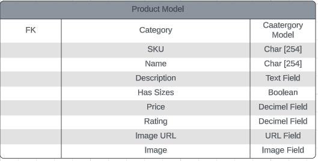

## Emerald Isle Jewelry

Emerald Isle Jewelry is a fictional jewelry store specilaising in Irish made Celtic Jewelry. The sotre is built using Django, Python, Bootstrap, HTML and CSS and the sites main goal is to provde the user with an east to use interface where they can purchase and browse all items the online store has to offer. 

The idea for this project came from an online store I built myself and have since close before which sold Celtic Jewely.

The deployed site can be viewed [here](https://emerald-isle-jewelry-af11dcd57db0.herokuapp.com/)

## UI/UX ##

The overall design is minimalistic and contemporary. High quality product images were used throughout os the overall theme was kep to a minimum as to not take away from those images. The overall layout is what you would espect from alot of E-commerce sites. A few products are dsplayed on the homepage along with some inviting links to encourage the user to delve deeper into the site.  

**Agile**

The agile approach was employed in designing and constructing this project, from the outset of planning to the completion of development. To facilitate the process, I established a GitHub project and adopted the Kanban board methodology to divide project components into user stories and feasible tasks.

For a comprehensive view of all user stories please refer to the linked project [Project Kanban Board](https://github.com/users/oconnorian3/projects/11/views/1). Additionally, each story has been assigned a label that indicates its level of significance in the site's overall functionality and acceptance.

## Wireframe ##

Below is a basic Wireframe of the homepage the project started.

## Planning Phase ##

**Strategy**

*Site Aims*

This is a fictional project but below are some aims if the site was to go into production.

Our aim is to celebrate and preserve the rich heritage of Celtic culture by offering a wide range of authentic Celtic jewelry designs inspired by traditional motifs and symbols. We strive to offer meticulously handcrafted Celtic jewelry pieces that showcase exceptional quality and attention to detail, ensuring that our customers receive timeless and durable pieces they can cherish for years to come. We strive to create a user-friendly and secure online platform that provides customers with a seamless shopping experience, offering detailed product information, multiple payment options, and prompt customer support.

The amount of products I could add is vast but due to time contraints and since this is a fictional project I will focus on they key items. Below are some core items this store would need to have. 

* Claddagh Rings
* Celtic Brooches
* Celtic Inpired Necklaces
* Celtic Inspired Earrings

The website caters to the following target groups:

 * User Roles:

    * Standard User
    * Account User
    * Administrator

 * Demographics

    * Mainly women with Irish Heritage
    * Main market will be the USA but Worldwide shipping will be an option

 * The website must provide the user with the ability to:

    * Browse and purchase products
    * Create an account 
    * Checkout as a guest user   
    * Fill out a contact form 
    * Leave a post sale testimonial

 * The website must provide the admin with the ability to:

    * Remove add and edit products 
    * Manage profiles  

*Scope*

In order to meet the project timeline and grading criteria, it is necessary to make trade-offs during the design and development process. To effectively manage this, I will employ the agile methodology. This involves conducting weekly progress reviews and making necessary adjustments to the features, whether by adding, adapting, or removing them, based on the project requirements. These reviews will be carried out after each sprint, ensuring that we deliver a Minimum Viable Product (MVP) by the specified deadline.

*Structure*

The site's layout is structured around ease of viewing products to make a seamless shopping experience and encourage sales. The home page has a large Shop Now button aswell as a featued Catergories and Product section. The nav bar also has a link to products aswell as various prompts/links throughout the site which will bring the user back to the producs page.

*Skeleton*

Wireframes were made using Lucid. Please click [here](https://github.com/oconnorian3/emerald-isle-jewelry/blob/main/README.md#Wireframe) to view Wireframes.

*Surface*

This pertains to the visual design aspect and how to effectively convey the desired emotions and effects. For a more comprehensive understanding of planning for the surface plane please see below.

**Colour Scheme**

A light green background (#ebf3eb) for all pages was chosen throughout the site. This fitted in well with the overall theme of the site while also remaining light enough to allow images and other features and links throughout the site standout. 

The colour (#494932) was used for the footer and various button and links throughout. This colour stands out and ties in well against the light green background while not been to harsh. 

**Fonts**

Add content

**Images and Logos/Icons**

The product images were taken from the our suppliers site. font awesome was used for the various icoms throughout the site. 

## Marketing Stratergy ##

**Introduction:**

Emerald Isle Jewelry is a boutique Irish business that takes pride in crafting exquisite Celtic jewelry, capturing the rich cultural heritage and beauty of Ireland. This marketing strategy outlines a comprehensive plan to elevate the brands presence, engage with the target audience, and drive sales through a combination of online and offline strategies.

1. Brand Identity and Positioning:
Highlight the authenticity, craftsmanship, and uniqueness of our Irish-made Celtic jewelry. Emphasize the blend of tradition and contemporary designs that sets Emerald Isle Jewelry apart in the market.

2. Website Enhancement:
Optimize the website for an enhanced user experience. Showcase high-quality images of our jewelry, provide detailed product descriptions, and create an easy-to-navigate layout. Incorporate customer testimonials to build trust.

3. Newsletter Signup:
Maximize the potential of thr newsletter signup form. 

4. Content Marketing:
Develop a blog section on the website to share articles about Celtic history, symbolism, jewelry care tips, and more. Create informative and engaging content that resonates with the audience's interests.

5. Social Media Strategy:
Leverage platforms like Instagram, Facebook, and Pinterest to visually showcase our jewelry. Regularly post high-quality images, behind-the-scenes glimpses of our craftsmanship, and stories that reflect the essence of Irish culture.

6. Influencer Collaborations:
Partner with influencers in the fashion and jewelry niche who align with the brand values. Their endorsement can introduce the jewelry to a wider audience and enhance our credibility.

7. Email Marketing Campaigns:
Send out regular newsletters to the subscribers, featuring new arrivals, limited-edition collections, and exclusive offers. Personalize the content to create a sense of exclusivity for subscribers.

8. Search Engine Optimization (SEO):
Implement strong SEO practices to improve the website's visibility on search engines. Optimize product descriptions, use relevant keywords, and focus on local SEO to attract customers searching for Irish jewelry.

9. Local Partnerships:
Collaborate with local Irish gift shops, cultural centers, and tourism outlets. Offer to showcase our jewelry in their establishments, expanding the reach within the local community and among tourists.

10. Customer Engagement and Feedback:
Encourage customer engagement through social media contests, polls, and interactive posts. Actively seek and showcase customer feedback and reviews to build trust and authenticity.

Incorporating these strategies will create a holistic approach to promoting Emerald Isle Jewelry. By enhancing the online presence, engaging with our audience authentically, and consistently delivering quality, we will strengthen our brand's position and drive growth for our business.

## Features ##

**Navigation**

 * Navigation bar with logo and links
 * Navigation bar with account login logo which allows customer access or create an account
 * Navigation bar with shopping bag logo which allows user view their total and their shopping bag
 * Responsive menu which collapes into a burger on small to medium screens
 * Search bar so user can search for what they want as opposed to trawling through product pages

**Landing Page**

 * The landing page will display a large hero image with a large Shop Now button
 * The landing page will display four featured Products and four featured Catergories
 * The landing page will display both the headers and footer with easily identifiable links to help the user navigate throughout the site
 * The landing page will display a free shipping banner across the top to encourage shoppers to hit the minimum limit for free shipping
 * The landing page will display a "subscribe" feature in the footer to allow users sign up for regular updates

**Testimonials**

 * Allows users view testimonials from previous customers
 * Users will receive a link in their order confirmation email with s link so they can provide a testimonial

**Contact Us**

 * This is a simple form which allows the user contact the site admins directly. The form will not submit unless all fields are filled out. The email field requires a valid email.
 * All information is saved to the database and can be easily accessed using the /admin url. 

 Insert Image

**Categories Section**

 * Allows user view products by catergory
 * Displays full list of products for that catergory 
 * Allows user sort producrs by price,rating,name & catergory for the all products section

 

**Product Pages**

 * Provides user with large image of the product
 * Provies a detailed product description
 * Allows user add product to their shopping bag
 * Allows user select size where appropriate
 * Allows user add whatever qunatity of the product they would like
 * Button in place to allow user go back to the products page

**My Account**

 *Register*

 * Allows users register for an account
 * Fields include Email address, Email Confirmation, Username, Password and Password confirmation
 * Has an embedded link which takes the user back to the login page should they need to

 *Login*

 * Login form asking for username and password of signed up user
 * Fields include Username/Email & Password
 * Includes "Remember me" checkbox option
 * Has an embedded link which takes the user back to the register page should they need to
 * Allows user reser their password should they need to

 *My Profile (For Authenticated Users Only)*

 * Allows users update their shipping information so they do not have to fill this field out during checkout
 * Allows users view past order history

    

 *Product Management (For Super Users Only)*

 * Allows users to add a new products through an easy to use interface
 * Also allows you delete or edit live products

    

 *Logout (For Authenticated Users Only)*

 * Separate page prompts user to confirm action to sign out

**Shopping Bag**

 * Allows users view the contents of the shopping bag
 * Allows users remove items 
 * Allows users update quantity
 * Allows users view total
 * Will let user know how much extras they need to spend for free shipping or cost off shipping as total stands
 * Gives user the option to keep shopping or proceed to checkout

 

**Checkout**

 * Prompts users to fill all required details and billing information. 
 * There is an "*" on required fields which will not allow you procees unless filled out
 * Embedded link allowing users to register or login to an account which would then save the billing information
 * Credit card field will alert user if credit card information is incorrect
 * Provides summary of purchase
 * Allows user to go back and adjust the shopping bag or proceed with purchase once all info is submitted
 * Fail safes are in place to process order correctly should user disconnect while sale is processing
 * Directs user to a success page to confirm transaction was successful

**Footer**

 * Users can submit their emails so they can subscibe to our marketing emails
 * Links to social media

**Custom 404**

## Oppurtunities For Future Features ##

 * Allow super users set a quantity for products so items which are out of stock become unavailble for purchase
 * Implement a pop up when the user visits the home page initially which would advertise a sale or ask for them to sign up to our newsletter
 * Automatically apply the rating value from the testimonial to the products as opposed to trying to work it out manually
 * Approve testimonials before they are published , they can however be removed 
 * Intergrate more social media
 * Add a blog

## Database Models ##

## Database Flowchart ##

I used Lucid to design the Database models.

## Testing ##

I have included testing details during and post-development in a separate document called [TESTING.MD](https://github.com/oconnorian3/emerald-isle-jewelry/blob/main/TESTING.md)

## Deployment ##

