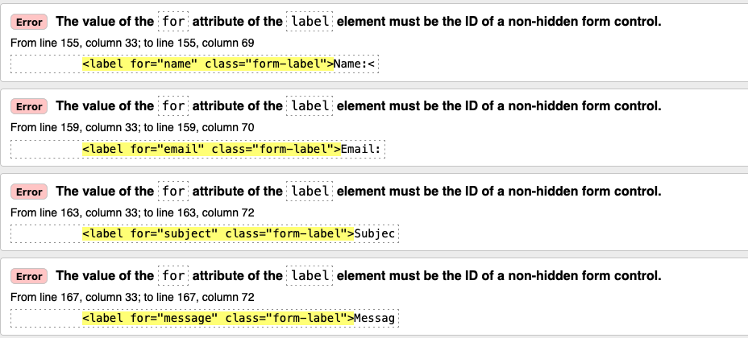

## Testing (Post Development)

**Validation**

[HTML](https://validator.w3.org/nu/?doc=https%3A%2F%2Femerald-isle-jewelry-af11dcd57db0.herokuapp.com)

All pages passed the above validator except of the contact page. Confirmed it does indeed work but unable to address the below as this would require a complete refactor which is not possible due to time contraints. 

[CSS](https://jigsaw.w3.org/css-validator/validator?uri=https%3A%2F%2Femerald-isle-jewelry-af11dcd57db0.herokuapp.com&profile=css3svg&usermedium=all&warning=1&vextwarning=&lang=en)

No CSS errors found.

**Python - PEP8 - using pycodestyle**

I utilized the "pycodestyle" tool to assess my Python code. "pycodestyle" is a command-line utility obtainable through pip installation. I executed the command "pycodestyle --first <-appname->," modifying it based on the documentation's recommendation. This command scans through all files within both the main and subdirectories of the app and promptly reports the initial encountered error.

I did work through all reported errors but there are a handful of E501 errorsin various files I decided not to shorten.
For example  the "AUTH_PASSWORD_VALIDATORS" settings in my settings.py file. It is bnot advisible to shorten those. 

## Lighthouse Scores 

**Home**

**Product Page**

**Checkout Page**

